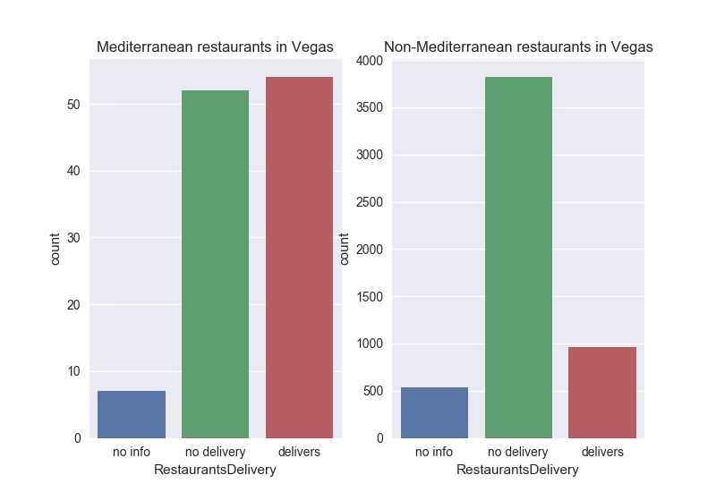

# Guessing Restaurants' Food Categories from Their Non-Culinary Attributes

Researchers in food studies have noted for a while that the food categories attached to restaurants (e.g. "ethnic", "New American") are often closely associated with perceptions of class and race. In principle, these food descriptors should refer only to the kind of food served as the restaurant, and other attributes like bike parking, outdoor seating, and whether a restaurant delivers should be able to vary independently of the type of food served. However, in practice we expect restaurants serving particular kinds of cuisines to have certain attributes relating to service, atmosphere, and so on. In this project I look at how these other non-food factors can help us predict how a restaurant's food is categorized. Is the number of reviews or average stars a good predictor of a restaurant's categories? I am particularly interested in categories with a fairly large number of restaurants, and which are familiar enough with the general public that one might expect data about them to reflect popular expectations and inclinations. Examples are categories like "ethnic food", "mediterranean", and "new American".

I am also interested in the extent to which models trained to predict food categories in one city could transfer their success to another city. Does the success of this transfer learning depend on whether the second city is part of the same cultural sphere, say the Anglophone sphere? Are models trained on US cities more transferable to Anglophone Toronto than to Francophone Montreal? How do they transfer to cities in Europe as compared to Montreal and Toronto? The code can be easily modified to be trained on one city and then tested on another.

## Data Sources

I use data from Round 9 of the [Yelp Dataset Challenge](https://www.yelp.com/dataset_challenge). I use only the file `'yelp_academic_dataset_business.csv'`. This contains information about the attributes and categories of restaurants from Edinburgh, Stuttgart, Montreal, Toronto, Pittsburgh, Charlotte, Urbana-Champaign, Phoenix, Madison, and Cleveland.

The data file was converted from JSON to CSV format using the conversion script provided by Yelp [here](https://github.com/Yelp/dataset-examples).

### Prerequisites

I processed the data using a Python script. To run the code, you need the Python packages csv, ast, numpy, scikit-learn, Pandas, xgboost, seaborn, and matplotlib.

### Scripts

I have divided the code into four parts.

`clean.py` processes the data file so that every feature of interest (both predictors and the feature to be predicted) has its own column. The more complicated bits of the code are for extracting the nested attributes that are characteristic of JSON data. Each row is assigned a label of 1 (True), 0 (False), or -1 (Unknown) depending on whether it has that feature. There is an option to filter by city or state. The processed data is then saved as a .csv file for the machine learning part.

`xgboost_cv.py` implements the XGBoost model that tries to predict whet arch carries out parameter optimization. This grid search is commented out for the final prediction with optimized parameters. At the end of the code, there is the option to load data from a different city and see if the model that is trained on data for one city also works on data from a different city.

`plot.py` plots graphics to further investigate how exactly the factors deemed "important" by XGBoost for prediction correlate with restaurants categories. One can plot histograms or bar plots that compare how many restaurants offering food category X have a certain property compared to all other restaurants, where X can be "ethnic food", for example, and the property might be wheelchair accessibility.

`dict_plot.py` plots a bar chart displaying the importances of various features for predicting the category of interest. For this plot you will need the dict of importances that XGBoost outputs.

## Results

At this stage of the (still ongoing) project, I have investigated factors predicting four different food categories: New American, Ethnic, Italian, and Mediterranean. I deemed these categories to be popular enough that one would be able to find trends in them relating to general social currents or expectations. Below, I excerpt some expected and unexpected results from my analysis.

###Ethnic Food

It is, perhaps unsurprisingly, much easier to predict whether a restaurant serves ethnic food, than it is to predict any of the other food categories I have investigated so far. Training on restaurants in Phoenix, the log loss for predicting whether a restaurant serves ethnic food is only 0.0495, which is much less than the log losses I get for predicting other categories. When tested on data from other cities, the log losses remain similar low, well below 0.1.

The most important factors predicting classification under "Ethnic Food" are the number of reviews and the average star count.

The average star count was higher by about 0.6 for restaurants classified as serving ethnic food.  Number of reviews was another important feature. Ethnic restaurants were clustered at the lower end of the range for number of reviews. While most non-ethnic restaurants were also in the same range, there was more of a "long tail" of non-ethnic restaurants in the higher end of the range.

Ethnic restaurants in Phoenix are also less likely to serve alcohol or have outdoor seating. When they do serve alcohol, they are much more likely to serve beer and wine, than to have a full bar. Non-ethnic restaurants are more likely to serve alcohol in general, but also much more likely to have a  full bar than to serve only beer and wine.

###Mediterranean Food

Mediterranean food is another perhaps overly general category that is associated with many stereotypes in the popular imagination. There are many regional differences between Greek food, Armenian food, Persian food, and so on that are elided by the general label "Mediterranean" (which usually is taken to exclude Southern France and Italy as well despite their geographical membership as part of the Mediterranean). For this reason, I thought it would be interesting to see if the notion of "Mediterranean" food was peculiarly (North) American and intertwined with stereotypes concerning other restaurant amenities. Would the features associated with Mediterranean restaurants in America extend to those in Europe?

I trained my algorithm to predict which restaurants would be classified as "Mediterranean" in Las Vegas. For this category, the loss was greater than that of the "ethnic" category, but still pretty low at ~0.103.

The most important factors for predicting classifcation as a Mediterranean restaurant were review count, price range, delivery, and outdoor seating.

Like ethnic restaurants, Mediterranean restaurants were more likely to be have fewer reviews. They were also far more likely to deliver, far more clustered in the "$$" rather than "$" category for price range, and far more likely to have outdoor seating. I show the distributions for delivery below.

###New American Food

New American is an interesting category to scope out because it has a particularly ambiguous meaning. Some commentators have referred to it as a ["catchall term for any cuisine that defies categorization"](http://www.chicagotribune.com/dining/ct-food-what-is-new-american-story.html), while others define it as ["modernized" American food with global influences, though stemming from French nouvelle cuisine](http://www.slate.com/articles/life/food/2015/06/new_american_food_is_un_american_derivative_and_bland.html). Wikipedia suggests that it is ["predominantly served at upscale fine dining restaurants"](https://en.wikipedia.org/wiki/New_American_cuisine) (these links accessed on June 5, 2017).

True to this cornucopia of definitions, New American is the hardest category to predict among those that I've investigated, having a higher loss than the Mediterranean, ethnic, or Italian categories. I trained my model on restaurants in Pittsburgh and obtained a log loss of 0.333. This is still significantly better than chance, though. The most important factors leading to a restaurant being classified as New American are as follows: number of reviews, being good for kids, having table service, and number of stars.

New American restaurants were more likely to have fewer stars than other restaurants. This result was somewhat surprising to me. They were more likely to have table service, which fits with the description of them being "upscale". They were more likely to have a higher number of reviews.

###Transfer Learning

The multinational, multi-region data suggests some interesting questions about whether categories of restaurants transfer across regions. For example, it's plausible that "Italian" food does not have the same meaning in North America as it does in Europe. This hypothesis was confirmed when I trained XGBoost to predict Italian restaurants on the Toronto data, and then tested the model on other cities. On Toronto, I obtained a log loss of about 0.246. This model obtained similar losses, or lower, on all other cities in North America except Pittsburgh and Montreal, where it incurred a loss of ~0.3. The loss on Edinburgh was similar to Montreal's, while the loss on Stuttgart was much higher, at 0.529. This suggests that "Italian food" is a category that is different in Anglophone compared to non-Anglophone countries, although this leaves the Pittsburgh anomaly unexplained.

The ethnic restaurant model trained on Phoenix data performed with low losses everywhere in North America and in Edinburgh where there were sufficient numbers of "ethnic" restaurants. There were not restaurants classified as "ethnic" in Montreal or Stuttgart to get reliable statistics. From this we can infer that it is reasonable to assume a "North American" and perhaps "Anglophone" notion of what ethnic restaurants are like in their non-food characteristics.

Mediterranean restaurants were also similarly susceptible to transfer learning---and this was a category in which we did have enough statistics in non-Anglophone areas. The model, trained on the Vegas set, had a loss of 0.103, and every other city that the model was tested on, including Stuttgart, Montreal, and Edinburgh, incurred a loss of at most 0.16. In fact Madison was the city on which the model had the highest loss, and Stuttgart was in the middle of the range in terms of loss. Mediterranean restaurants, then, might appear to be a relatively transferable category in North America and Europe. It would be interesting to investigate the social reasons behind this.
